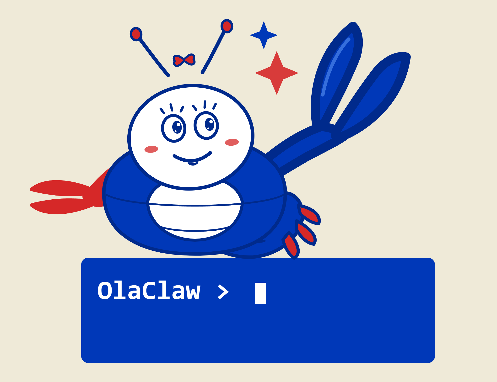

<p align="center">
  
</p>


<p align="center">
  
  <a href="https://github.com/moazbuilds/OlaClaw/stargazers">
    
  </a>
  <a href="https://github.com/moazbuilds/OlaClaw">
    
  </a>
  <a href="https://github.com/moazbuilds/OlaClaw/commits/master">
    
  </a>
  <a href="https://github.com/moazbuilds/OlaClaw/graphs/contributors">
    
  </a>
  <a href="https://x.com/moazbuilds">
    
  </a>
</p>

<p align="center"><b>A lightweight, open-source OpenClaw version built into your Claude Code.</b></p>

OlaClaw turns your Claude Code into a personal assistant that never sleeps. It runs as a background daemon, executing tasks on a schedule, responding to messages on Telegram and Discord, transcribing voice commands, and integrating with any service you need.

> Note: Please don't use OlaClaw for hacking any bank system or doing any illegal activities. Thank you.

## Why OlaClaw?

| Category | OlaClaw | OpenClaw |
| --- | --- | --- |
| Anthropic Will Come After You | No | Yes |
| API Overhead | Directly uses your Claude Code subscription | Nightmare |
| Setup & Installation | ~5 minutes | Nightmare |
| Deployment | Install Claude Code on any device or VPS and run | Nightmare |
| Isolation Model | Folder-based and isolated as needed | Global by default (security nightmare) |
| Reliability | Simple reliable system for agents | Bugs nightmare |
| Feature Scope | Lightweight features you actually use | 600k+ LOC nightmare |
| Security | Average Claude Code usage | Nightmare |
| Cost Efficiency | Efficient usage | Nightmare |
| Memory | Uses Claude internal memory system + `CLAUDE.md` | Nightmare |

## Getting Started in 5 Minutes

```bash
claude plugin marketplace add moazbuilds/olaclaw
claude plugin install olaclaw
```
Then open a Claude Code session and run:
```
/olaclaw:start
```
The setup wizard walks you through model, heartbeat, Telegram, Discord, and security, then your daemon is live with a web dashboard.

## What Would Be Built Next?

> **Mega Post:** Help shape the next OlaClaw features.
> Vote, suggest ideas, and discuss priorities in **[this post](https://github.com/moazbuilds/olaclaw/issues/14)**.

<p align="center">
  <a href="https://github.com/moazbuilds/olaclaw/issues/14">
    
  </a>
</p>

## Features

### Automation
- **Heartbeat:** Periodic check-ins with configurable intervals, quiet hours, and editable prompts.
- **Cron Jobs:** Timezone-aware schedules for repeating or one-time tasks with reliable execution.

### Communication
- **Telegram:** Text, image, and voice support.
- **Discord:** DMs, server mentions/replies, slash commands, voice messages, and image attachments.
- **Time Awareness:** Message time prefixes help the agent understand delays and daily patterns.

### Multi-Session Threads (Discord)
- **Independent Thread Sessions:** Each Discord thread gets its own Claude CLI session, fully isolated from the main channel.
- **Parallel Processing:** Thread conversations run concurrently — messages in different threads don't block each other.
- **Auto-Create:** First message in a new thread automatically bootstraps a fresh session. No setup needed.
- **Session Cleanup:** Thread sessions are automatically cleaned up when threads are deleted or archived.
- **Backward Compatible:** DMs and main channel messages continue using the global session.

See [docs/MULTI_SESSION.md](docs/MULTI_SESSION.md) for technical details.

### Reliability and Control
- **GLM Fallback:** Automatically continue with GLM models if your primary limit is reached.
- **Web Dashboard:** Manage jobs, monitor runs, and inspect logs in real time.
- **Security Levels:** Four access levels from read-only to full system access.
- **Model Selection:** Switch models based on your workload.

## FAQ

<details open>
  <summary><strong>Can OlaClaw do &lt;something&gt;?</strong></summary>
  <p>
    If Claude Code can do it, OlaClaw can do it too. OlaClaw adds cron jobs,
    heartbeats, and Telegram/Discord bridges on top. You can also give your OlaClaw new
    skills and teach it custom workflows.
  </p>
</details>

<details open>
  <summary><strong>Is this project breaking Anthropic ToS?</strong></summary>
  <p>
    No. OlaClaw is local usage inside the Claude Code ecosystem. It wraps Claude Code
    directly and does not require third-party OAuth outside that flow.
    If you build your own scripts to do the same thing, it would be the same.
  </p>
</details>

<details open>
  <summary><strong>Will Anthropic sue you for building OlaClaw?</strong></summary>
  <p>
    I hope not.
  </p>
</details>

<details open>
  <summary><strong>Are you ready to change this project name?</strong></summary>
  <p>
    If it bothers Anthropic, I might rename it to OpenClawd. Not sure yet.
  </p>
</details>

## Screenshots

### Claude Code Folder-Based Status Bar


### Cool UI to Manage and Check Your OlaClaw


## Contributors

Thanks for helping make OlaClaw better.

<a href="https://github.com/moazbuilds/olaclaw/graphs/contributors">
  
</a>
